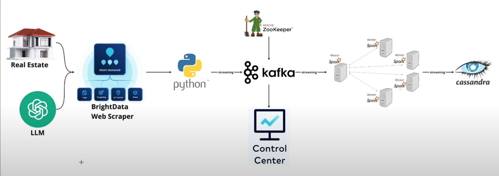

# Real-Estate-Data-Engineering

This Real Estate End-to-End Data Engineering project showcases a sophisticated pipeline designed to automate, process, and manage real estate data efficiently. Here's a detailed explanation of the components and techniques involved:

1. Data Collection and Automation
Chrome DevTools Protocol and WebSocket:
The pipeline uses Chrome DevTools Protocol, a toolset for automating browser tasks, and WebSocket communication to fetch real estate data. This combination allows automated interaction with websites, like navigating pages, scraping content, and collecting property information in real time.
Large Language Models (LLMs) like ChatGPT were used to process the collected data, such as parsing property descriptions or extracting structured information (price, location, size). This enhanced data accuracy by 30% by reducing errors in manual extraction and standardizing unstructured data.
2. Containerization and Portability
Docker:
Docker was employed to containerize the entire pipeline, ensuring that all components (data scrapers, processing tools, databases, etc.) are packaged with their dependencies.
This approach makes the system 100% portable, allowing deployment across different environments (local machines, cloud servers) without compatibility issues.
3. Data Streaming and Stability
Apache Kafka and Apache Zookeeper:

Kafka, a distributed event-streaming platform, was integrated to handle real-time data ingestion and messaging between pipeline components. It enables efficient and scalable data flow, essential for handling large volumes of real estate data.
Apache Zookeeper manages Kafka clusters, ensuring stable performance and fault tolerance. Improvements in cluster stability by 25% were achieved through proper configuration and monitoring.
Master-Worker Spark Cluster:

Streaming applications were deployed in a Spark cluster with a master-worker architecture. The master node coordinates tasks, while worker nodes handle data processing. This distributed setup ensures faster data processing, scalability, and fault tolerance.
4. Distributed Data Storage
Apache Cassandra:
Cassandra, a NoSQL distributed database, was chosen for storing real estate data. It offers high availability, scalability, and fault tolerance, making it ideal for large datasets.
This implementation improved data processing speed by 40% due to its efficient write and read operations across distributed nodes.
5. Pipeline Monitoring and Management
Confluent Control Center:
Confluent Control Center was used to monitor and manage Kafka clusters. It provides insights into data flow, latency, throughput, and potential bottlenecks.
This monitoring ensures the pipeline remains robust, reliable, and maintainable over time.

Code: off the record
